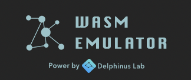

<p align="center">
  
</p>

<p align="center">
  <a href="https://github.com/DelphinusLab/zkWasm/blob/main/LICENSE"></a>
</p>

# Overview：

The mission of DelphiusLab is to provide Web2 developers with a concise toolset to leverage the power of Web3 in their applications. The ZKWASM (ZKSNARK virtual machine that supports Web Assembly) serves as a trustless layer between rich applilcations running on WASM runtime and smart contracts on chain.

WASM (or WebAssembly) is an open standard binary code format similar to assembly. Its initial objective was to provide an alternative to java-script with improved performance for the current web ecosystem. Benefiting from its platform independence, front-end flexibility (can be compiled from the majority of languages including C, C++, assembly script, rust, etc.), good isolated runtime and speed comes closer to the speed of a native binary, its usage is arising in distributed cloud and edge computing. Recently it has become a popular binary format for users to run customized functions on AWS Lambda, Open Yurt, AZURE, etc.

The idea of ZKWASM is derived from ZKSNARK (Zero-Knowledge Succinct Non-Interactive Argument of Knowledge) which is a combination of SNARG (Succinct non-interactive arguments) and zero-knowledge proof. In general, the adoption of ZKSNARK usually requires implementing a program in arithmetic circuits or circuit-friendly languages (Pinocchio, TinyRAM, Buffet/Pequin, Geppetto, xJsnark framework, ZoKrates) that forms a barrier for existing programs to leverage it's power. An alternative approach is, instead of applying ZKSNARK on the source code, applying it on the bytecode level of a virtual machine and implementing a zksnark-backed virtual machine. In this work, we take the approach of writing the whole WASM virtual machine in ZKSNARK circuits so that existing WASM applications can benefit from ZKSNARK by simply running on the ZKWASM, without any modification. Therefore, the cloud service provider can prove to any user that the computation result is computed honestly and no private information is leaked.


# Circuit Details:
https://jhc.sjtu.edu.cn/~hongfeifu/manuscriptb.pdf

# Quick start with ZKWASM command line

## Dependency

Make sure the following packages are installed.
```
clang lld
```
## Install Instructions
```
git clone --recurse-submodules https://github.com/DelphinusLab/zkwasm
cargo build
```

## Setup input:
wasm code

## Runtime input:
input of wasm function and the top level function must be zkmain

## Proving target:
simulation of wasm execution of target wasm bytecode with particular inputs are correct.

# Command line:
## Setup via WASM image:
```
cargo run --release -- --host default --function <FUNCTION_NAME> --wasm <WASM_BINARY> setup [OPTIONS]
```

## Single prove and verify:
```
cargo run --release -- --host default --function <FUNCTION_NAME> --wasm <WASM_BINARY> single-prove [OPTIONS]
cargo run --release -- --host default --function <FUNCTION_NAME> --wasm <WASM_BINARY> single-verify [OPTIONS]
```
with OPTIONS:
```
    -h, --help                         
        Print help information
        --host <HOST_MODE>... 
        Which host env you would like to run your binary. [possible values: default, standard]

    -k [<K>...]                        
        Circuit Size K

    -o, --output [<OUTPUT_PATH>...]
        Path of the output files.
        The md5 of the wasm binary file is the default path if not supplied.

    -p, --param [<OUTPUT_PATH>...]
        Path of the parameter files. (trusted setup, etc)
        The md5 of the wasm binary file is the default path if not supplied.

    --private [<PRIVATE_INPUT>...]
        Private arguments of your wasm program arguments of format value/filename:type where
        type=i64|bytes|bytes-packed|file, multiple values should be separated with ' ' (space); file should be encoded with binary BigEndian bytes order

    --public [<PUBLIC_INPUT>...]
        Public arguments of your wasm program arguments of format value:type where
        type=i64|bytes|bytes-packed, multiple values should be separated with ' ' (space)
```
## Batch prove and verify:
Please see zkWASM continuation batcher at https://github.com/DelphinusLab/continuation-batcher for batching proof with host circuits and verifier generation in smart contracts.

# Operations Spec [WIP]
We uses z3 (https://github.com/Z3Prover/z3) to check that all operation are compiled to zkp circuits correctly.

[This is a WIP project, only sample code are provided here. Please contact xgao@zoyoe.com for state circuit customization and application integration. 

# Issue tracking:
* chore: non-feature requirements such as CI/CD, building script or work flow enhancement.
* feat: feature need, we could use feat(circuit), feat(lang), feat(CLI) to categorize features
* bug: bug report, we also could use bug(circuit), bug(lang) to categorize bugs
* doc: documents related issues.

# Project Bootstrap:
* C project: There is a project template for compiling C to wasm with limited host functions (foreign circuits). (see https://github.com/DelphinusLab/zkWasm-C)
* Rust project demo: https://github.com/xgaozoyoe/zkWasm-Rust-Demo
* Assembly script demo: https://github.com/DelphinusLab/zkWasm-AssemblyScript-Demo
* Browser based project: See https://github.com/zkcrossteam/g1024/ for how to utilizing zkWASM in javascript, how to generate proofs using PAAS service and verify it on chain (contact xgao@zoyoe.com for details about PAAS testnet).
